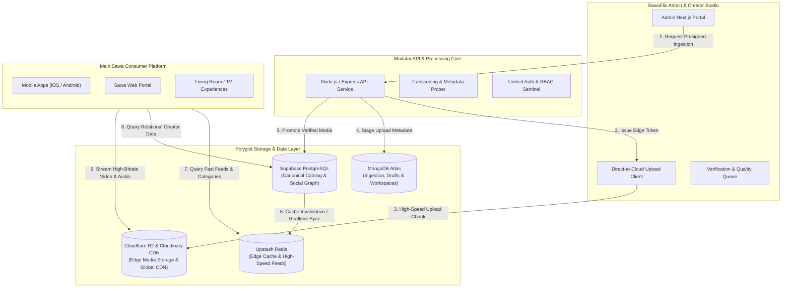
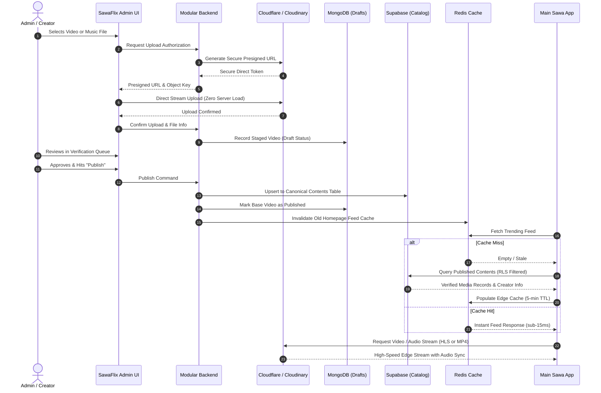

# SawaFlix Platform Architecture & Data Flow Guide

An architectural blueprint and system flow guide explaining how the SawaFlix Admin Portal, Backend Services, Polyglot Data Layer (MongoDB, Supabase, Cloudflare R2, Cloudinary, Redis), and the Main Consumer Sawa App operate in harmony.

---

## 1. Executive System Overview

SawaFlix is built on a **Decoupled Modular Architecture** paired with **Polyglot Persistence**. Rather than forcing one database to handle relational social graphs, document ingestion queues, and multi-gigabyte video blobs, SawaFlix assigns every workload to the optimal storage and compute engine:

---

## 2. The Polyglot Data Layer: Why Each Engine Matters

### A. MongoDB Atlas (Ingestion & Workspaces)
- **Primary Function**: Ingestion buffer, draft workspace, video upload tracker, and unstructured processing metadata.
- **Why NoSQL for this Phase**:
  - Video and audio files arrive with arbitrary formats, dimensions, codecs, bitrates, audio channels, and chunk sizes.
  - While a creator or admin is uploading a 4K movie or high-res audio track, the file is in an intermediate state (e.g. `uploading`, `transcoding`, `probed`, `draft`).
  - Storing these flexible, transient states in MongoDB ensures that rapid progress reports, retry counters, and processing failure reasons do not trigger heavy schema migrations or table locks in the primary relational database.

### B. Supabase PostgreSQL (The Canonical Platform Core)
- **Primary Function**: The single source of truth for all public and consumer data.
- **Why Relational PostgreSQL for this Phase**:
  - Content on SawaFlix does not exist in isolation: it belongs to an **Artist/Creator profile**, which is tied to **Followers**, **Genres**, **Verification Badges**, **Playlists**, **Copyright Licenses**, and **Monetization Agreements**.
  - PostgreSQL enforces strict relational integrity, preventing orphaned records (e.g., videos without a valid verified creator).
  - Row Level Security (RLS) ensures that only published, age-appropriate, and geographically unrestricted media can be read by public consumer tokens.
  - Built-in Realtime subscriptions allow the main Sawa app to automatically refresh live feeds whenever an admin publishes content without needing manual polling.

### C. Cloudflare R2 & Cloudinary (Edge Storage & CDN Streaming)
- **Primary Function**: Infinite-scale binary media storage and worldwide media distribution.
- **Why Object Storage & Edge CDN**:
  - Databases are optimized for structured rows and documents, not gigabytes of binary video bytes.
  - Cloudflare R2 provides zero-egress cost storage for high-volume uploads.
  - Cloudinary and Cloudflare Global Edge CDNs automatically optimize delivery based on device screen resolution, geographical proximity, and connection speed (adaptive streaming via HLS and progressive MP4/MP3).
  - Direct browser-to-bucket presigning prevents media files from saturating backend server memory or network bandwidth.

### D. Upstash Redis (Edge Cache & Feed Accelerator)
- **Primary Function**: Sub-15 millisecond feed caching, session verification, and trending rate counters.
- **Why In-Memory Caching**:
  - When thousands of users open the Sawa mobile app simultaneously, serving the homepage, trending music list, and category carousels directly from memory guarantees zero database saturation and instant UI loading.

---

## 3. Monolithic Simplicity vs. Polyglot Power

SawaFlix embraces a **Modular Monolith** architecture:

1. **Unified Application Core**:
   - The backend runs as a clean, cohesive service rather than a dozen fragmented microservices.
   - Benefits include unified authentication, zero inter-service network latency, atomic operations, and drastically simplified development and deployment.
2. **Polyglot Data Freedom**:
   - While the code runs within a cohesive service, it communicates with specialized data stores.
   - Ingestion is handled by MongoDB, relational integrity by Supabase, high-speed delivery by Redis, and heavy media by Cloudflare/Cloudinary.
   - This gives SawaFlix the developer velocity of a monolithic codebase combined with the extreme scalability of specialized cloud databases.

---

## 4. The Complete Lifecycle: From Upload to Streaming

---

## 5. How the Main Sawa App Fetches and Renders this Data

When the consumer opens the Main Sawa App (on iOS, Android, or the Web), the client executes a structured multi-tier fetch pipeline:

### 1. Feed Initialization & Cache Query
- The app requests the curated homepage feed (Hero Carousels, Top 20 Artists, Trending Videos, New Music Releases).
- The request passes through the caching layer (Redis) which returns the pre-computed feed payload in under 20 milliseconds.

### 2. Relational Deep-Dives from Supabase
- When the user taps on a creator's name (e.g. "Kocee"), the app queries Supabase directly:
  - Fetches the creator profile and verified badge status.
  - Fetches the creator's full discography and filmography using foreign keys.
  - Retrieves user interactions (likes, saves, subscriber status) in an authorized query.

### 3. Smart Media Streaming Engine
- **Video Streams**:
  - The player receives the clean, signed CDN URL from the canonical content record.
  - If the user is on mobile 4G/5G, the player automatically selects the optimal HLS bitrate ladder (720p, 1080p, or 4K).
  - Native hardware acceleration decodes the video frames while maintaining synchronous multi-channel audio playback.
- **Music & Audio Tracks**:
  - The app routes audio content through a background-capable media service.
  - Multi-source audio negotiation ensures instantaneous playback with lock-screen metadata (cover art, artist name, track scrub controls).

### 4. Realtime Catalog Synchronization
- Whenever the Admin Portal publishes a new video or updates an artist's rank in the Top 20, Supabase emits a PostgreSQL notification event.
- The consumer app receives this event over a lightweight WebSocket channel and silently updates the feed, ensuring users always see new releases immediately without needing to reload the application.

---

## 6. Architecture Quality Checklist

| Attribute | Implementation Strategy | Platform Benefit |
| :--- | :--- | :--- |
| **Fault Isolation** | Heavy video uploads bypass application servers directly to storage buckets. | Admin portal and streaming backend never experience memory exhaustion or CPU lag during large uploads. |
| **Data Integrity** | Relational constraints and foreign keys inside Supabase PostgreSQL. | Zero broken links, missing creator relationships, or orphaned playlists. |
| **High Performance** | Dual-tier caching with Edge CDN for media and Redis for structured feeds. | Instantaneous page navigation, zero video buffering, and sub-second cold starts. |
| **Security & Privacy** | Row Level Security (RLS) policies and short-lived presigned download signatures. | Unverified drafts and private content can never be accessed by unauthorized clients. |
